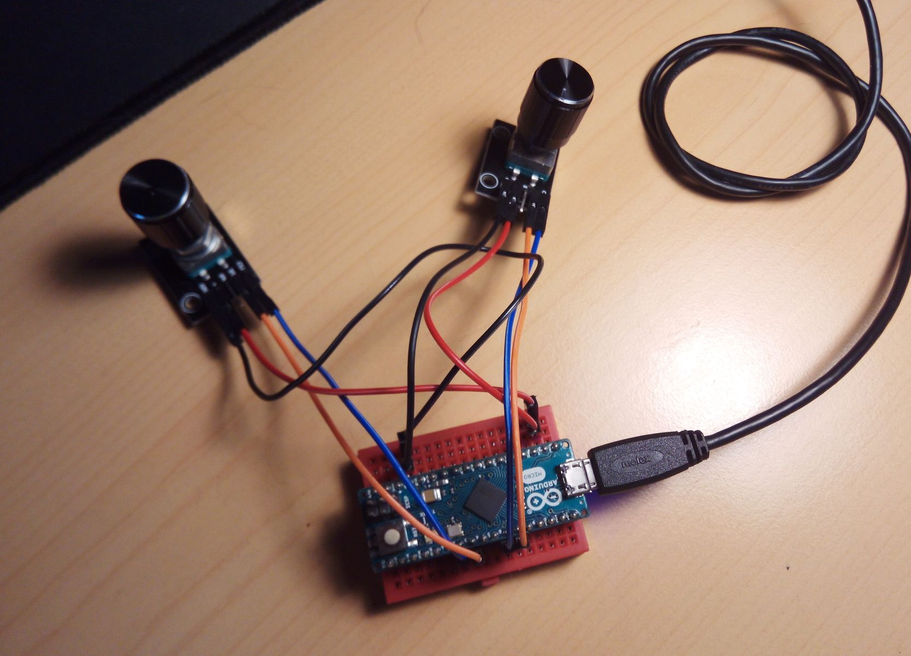

# ArduSpinner


A simple dial (aka spinner) input control using arduino and a rotary encoder. The dial is shown
in the computer as a mouse with X movement. The movement has been tuned to be "accelerated" so
if you do small movements, you have precision, but if you move it kickly, it runs faster. Use
a modified version of [ClickEncoder](https://github.com/0xPIT/encoder) library. See below for
more details.

<a href="https://youtu.be/IPjfnaJqFXc">Demo video on YouTube</a>

This project provides:

1. The chassis' fabrication models (3D print) and assembly guide.
2. The arduino sketch to control the encoder and pass the mouse inputs to the computer.

# Table Of Contents

- [ArduSpinner](#arduspinner)
- [Table Of Contents](#table-of-contents)
- [Project Features](#project-features)
- [Part List](#part-list)
- [3D Printing and assembly](#3d-printing-and-assembly)
  - [Parts](#parts)
    - [Wheel](#wheel)
    - [Chassis](#chassis)
    - [Arduino Holder](#arduino-holder)
    - [Spacers](#spacers)
  - [Assembly](#assembly)
  - [Arcade Installation](#arcade-installation)
- [Electronics](#electronics)
  - [Encoder Mod](#encoder-mod)
  - [Wiring](#wiring)
- [Software](#software)
  - [Install](#install)
    - [TimerOne](#timerone)
    - [ClickEncoder](#clickencoder)
    - [ArduSpinner](#arduspinner-1)
    - [ArduspinnerButton](#arduspinnerbutton)
  - [Tests](#tests)
  - [Binary](#binary)
  - [MAME](#mame)
  - [Two Encoders](#two-encoders)

# Project Features

1. Complete implementation for a dial (aka spinner) input control. Just print the files, wire it, download the sketch and play in MAME. The main motivation was to create a low profile, MAME compatible (in fact, it works in all computers that accept a USB mouse as input) input device to play `arkanoid` style games.
2. Low profile device. Just about 3cm width, 8cm height.
3. Easy to use. Just plug and play with minimum MAME configuration.
4. Easy to build.
5. Cheap.

# Part List

To build `ArduSpinner` you need the following things:

* Arduino Micro or similar, with the ATmega32U4 processor, so we can program the USB interface. Try to build the original one [Arduino Micro](https://store.arduino.cc/arduino-micro) (18 €) to support *Arduino*, or, if you're in budget, try this clone from [Amazon](https://www.amazon.es/gp/product/B01MTU9GOB/ref=ppx_yo_dt_b_asin_title_o00_s00?ie=UTF8&psc=1) (4.6 €), but you have to solder.

* Rotary encoder. I use the `KY-040` rotary encoder, mounted in a PCB. Get it from [Amazon](https://www.amazon.es/gp/product/B07D356LRH/ref=ppx_yo_dt_b_asin_title_o09_s00?ie=UTF8&psc=1) (2,04€)

* Some wiring cable. I use `dupont` wires (female-female. You need 4 of them), again, a pack from [Amazon](https://www.amazon.es/gp/product/B07D356LRH/ref=ppx_yo_dt_b_asin_title_o09_s00?ie=UTF8&psc=1) (6,19€, lots).

* A simple Micro USB cable (DATA, no the stripped version for charge). Just like these [Amazon](https://www.amazon.es/AUKEY-Rápida-Sincronización-Teléfonos-AndroidSamsung/dp/B01N1NPL8O/ref=sr_1_5?__mk_es_ES=ÅMÅŽÕÑ&keywords=microusb&qid=1568702726&refinements=p_85%3A831314031&rnid=831276031&rps=1&s=electronics&sr=1-5) (7,99 €) 

* Two small (3mm x 5mm or similar) screws if you want to mount the arduino holder in the back.

* Total: **34,22 €** if you buy the "original" kit.
* Total: **6,64 €** if you have some dupont cables and the micro USB cable. (just buy the arduino and the rotary encoder)

* Also, you need a 3D Printer, of course, if you plan to print the parts.

# 3D Printing and assembly

There are 4 parts that you have to print. The STL are ready positioned in the "right" way to be printed, so just
print them as is. I use a Ender-3 Pro with Marlin Firwmare, and PLA, and get good results.
I use CURA for slicing with the following major configuration settings:


|Variable                                        |Value    |
|------------------------------------------------|--------:|
|Layer Height| 0.21|
|Initial Layer Height| 0.32|
|Wall Thickness| 0.88|
|Wall Line count| 3|
|Top/Bottom Thickness| 0.92|
|top Thickness| 0.92|
|Top Layers| 5|
|bottom Thickness| 0.92|
|bottom Layers| 5|
|Top/Bottom pattern| lines|
|Horizontal expansion| 0|
|Infill density| 60%|
|Infill pattern| grid|
|Printing temperature| 190|
|Printing temperature initial layer| 195|
|Build plate temperature| 55|
|Build plate temperature initial layer| 75|
|Initial Layer flow| 100|
|Enable retraction| Checked|
|Retraction Distance| 6.5|
|Retraction Speed| 50|
|Print Speed| 50|
|Infill Speed| 50|
|Wall speed| 25|
|Top/Bottom speed| 25|
|Travel Speed| 150|
|Initial Layer Print Speed| 15|
|Initial Layer Travel Speed| 30|
|Combing mode| All|
|Avoid Supports when travelling| checked|
|Z Hop when retracted| checked|
|Enable Print cooling| checked|
|Fan Speed| 100|
|Initial Fan Speed| 0|
|Regular Fan Speed at Height| 0.72|
|Regular Fan Speed at Layer| 3|
|Generate Support| Checked|
|Support Placement| Everywhere|
|Support Overhang Angle| 47|
|Support Pattern| ZigZag|
|Support Density| 20|
|Support Z Distance| 0.2|
|Suport X/Y Distance| 0.88|
|User Towers| unchecked|
|Build plate adhesion type| None|
|Surface mode| Normal|
|Enable Bridge Settings| Checked|

<br>

This table resumes the printing times for my Ender-3 configuration:


|part name       |cuantity|color|printing time hh:mm|
|----------------|--------|-----|------------------:|
|wheel           |1       |black|              03:35|
|chassis         |1       |green|              00:31|
|arduino holder  |1       |green|              00:08|
|spacers         |2       |green|              00:03|

(I print the wheel in black, alone, and the rest of them in green, all together)

## Parts

### Wheel

* [STL]("stl/wheel.stl")
* [Thingiverse](https://www.thingiverse.com/thing:3866147)


### Chassis

* [STL]("stl/chassis.stl")
* [Thingiverse](https://www.thingiverse.com/thing:3866148)


### Arduino Holder

* [STL]("stl/arduino_holder.stl")
* [Thingiverse](https://www.thingiverse.com/thing:3866149)


### Spacers

* [STL]("stl/spacers.stl")
* [Thingiverse](https://www.thingiverse.com/thing:3866151)


## Assembly

It's very easy: I recommend you to [wire](#wiring) it first:

1. Put the encoder with the connectors as shown in the first photo, and screw the nut tight.
2. Put the spaces between the arduino holder and the back of the encoder, and screw then. Yo get something like a sandwitch (second photo). This allows to create some force between the rod and the back of the encoder.
3. Put the wheel in the rod. Check that the chanfer inside the wheel fits the chanfer in the encoder's rod. Push to the end and you get arduspinner mounted.
4. Press the arduino inside the arduino holder, if you want to mount it there.


## Arcade Installation

I design the ArduSpinner to get a low profile, so you can install it in the joystick plate from your arcade machine. 
I cut a hole of 6.5cmx2.5cm in the table, and screw the ArduSpinner to it. The arcade machine is an own design and it is slim (wood width is about 1cm), but ArduSpinner can be fitted from 1.6cm to 1cm wood boards (or less).


# Electronics

## Encoder Mod

The `KY-040` encoder is a continuous encoder, so you can rotate from left to right continuous. But to "feel" it, the
encoder comes with some *detents* so you get feedback when rotate it. To play, is somewhat crappy, so I remove the *detents*. This part is just a simple spring that detents the encoder plate. It's easy to remove it.


1. Remove the metallic cover, put in place with 4 pins. Use a plyer and straight them, and remove it (left size of the photo)


2. You find the upper part, the rod with the encoder, and the lower one, the contacts with the button, made in plastic We need to fix the upper part (the rod) so don't mess to much with the lower one (lower part not shown).
3. Remove the plate encoder (just pull) and remove with the plyer the spring (the metallic part in the center of the first photo), then push the plate again into the rod. The should move freely.
4. Assembly the thing. Check for the small metallic plate in the lower part (the button) is in place, put the metallic cover and bend again the pins, and you get a smooth encoder without detents, and a free spring.


## Wiring

|Encoder PIN   |Arduino PIN|Wire Color| Notes                    |
|--------------|-----------|----------|-------------------------:|
|`GND`         |`GND`      |black     |                          |
|`+`           |`VCC`      |red       |Works on 5V and 3V        |
|`SW`          |`D4`       |white     |Not used, so not connected|
|`DT`          |`D2`       |grey      |Digital Interrupt PIN     |
|`CLK`         |`D3`       |pink      |Digital Interrupt PIN     |


# Software

This sketch only works on boards with the **ATmega32U4**, so the USB interface can be reprogrammed to simulate a USB device (HID) and send inputs to the computer. It's possible to use a software USB stack and use a ESP8266, but it is very complex and only allow a small range of posibilitites. With the new ESP-Pro version, we can reprogram the USB controller as the ATmega32U4. You can use Arduino *Leonardo* or *Micro* (I use the last one for size). Pick the original board if you can to support Arduino.

The software is very simple: Just read the data from the rotary encoder, and map it to mouses' X position.
There's not so much to be configured, so it should work as is. You can change the PIN assigments, but remember
that D2 and D3 are the digital pins that allows interrupts, so if you plan to modify the sketch to use interrupts instead of polling, leave them as is.

**IMPORTANT NOTE: On MacOS 10.12.6 I can't get the Leonardo's USB interface with Arduino IDE 1.8.8 working. So please use Windows to burn the Sketch, or use a more updated version of MacOS.**

## Install

You need the following libraries installed in your Arduino `libraries` folder.

* [TimerOne](https://github.com/PaulStoffregen/TimerOne)
* My modified version of [ClickEncoder](https://github.com/0xPIT/encoder)

### TimerOne

This library is required in order to work, so you can install it from the Arduino IDE's Library Manager. Just go to
`Sketch->Include Library->Manage Libraries` menu, and search for `TimerOne`. Add it and that's all.

[TimerOne](https://github.com/PaulStoffregen/TimerOne)

### ClickEncoder

I modify the library to reset the Acceleration when the direction changes, and tuned the acceleration values for my application, so you need to copy it to the Arduino `libraries` folder (Usually in your `Documents` folder). Just copy the `encoder` directory.

[ClickEncoder](https://github.com/juanmcasillas/encoder)

### ArduSpinner

After install and copy the libraries, just restart the Arduino IDE, and open the `arduspinner.ino` sketch. Now,
Just select in the `Tools` Menu, `Boards` and check the `Leonardo`. Select the port, and flash `arduspinner.ino` on it. That's all. When you move the spinner, the led flashes. 

Uncomment `//#define RELASE 1` if you want debug output to the Serial Monitor (at 115200 bauds)

### ArduspinnerButton

The same version as before, but uses the `PIN 4` (connected to `SW` pin in the rotary). The sketch reads the button, and
If single click, sends a mouse click for the `LEFT` button. If double clicked, sends a mouse click for the `RIGHT` button.

## Tests

In `dev/` folder you could find some tests. They are created to test some functionality. Just for reference.

* `test1` Encoder test with interruption handling.
* `test2` Polling work with button handling.
* `test3` Polling example with debounce. Doesn't work properly.
* `test4` [MD_REncoder](https://github.com/MajicDesigns/MD_REncoder/) library test. Works. Also includes mouse HID.
* `test5` [ClickEncoder](https://github.com/0xPIT/encoder) Library test. Requires also *TimerOne* library
* `test6` My test implementation with interrupts.


## Binary

I provide the compiled version for the sketch:

* `arduspinner/arduspinner.ino.leonardo.hex`
* `arduspinner/arduspinner.ino.with_bootloader.leonardo.hex`

You can put the file directly in the arduino using for example [avrdude](https://stackoverflow.com/questions/45646127/how-to-upload-a-hex-file-into-an-arduino-leonardo-using-avrdude-from-the-command) or [Arduino Builder](https://forum.arduino.cc/index.php?topic=151774.0)
the process is fairly complex and you can brick the arduino. I recommend you to build and flash using the ide istead, but if you want to try, you're welcome.


## MAME

There is a minimum configuration in `mame.ini` file. Just change `keyboard` to `mouse` for `dial_device`. Save
and play. The MAME options for Analog input are set as default (I don't change them). Enjoy!

```
#
# CORE INPUT AUTOMATIC ENABLE OPTIONS
#
dial_device mouse
```


As a side note, if you run your arcade in windows 7 and you want that Windows doesn't start never in recovery mode,
log into windows, and launch a `cmd` as administrator. then run this:

```
% bcdebit /set {default} recoveryenabled No
% bcdebit /set {default} bootstatuspolicy IgnoreAllFailures
```


## Two Encoders

Andy ask me about how to manage two encoders at same time. At first I think it was pretty straightforward, but there was a sightly internal "bug" in the [ClickEncoder](https://github.com/0xPIT/encoder) with the 
default constructor, and `WITHOUT_BUTTON` macro. I think there's some problem when you initializate two object of the same type with this macro (the debug shows that in the second one, the Y encoder, it doesn't
honor the macro def) So I fix the Constructor in my forked version [ClickEncoder](https://github.com/juanmcasillas/encoder) and add the `WITHOUT_BUTTON` macro in the `.h` file. You can test two encoders (e.g. for
X, Y management using [arduspinnerXY](https://github.com/juanmcasillas/ArduSpinner/blob/master/arduspinnerXY/arduspinnerXY.ino) sketch. In the image below you can see an example wiring for two encoders.

